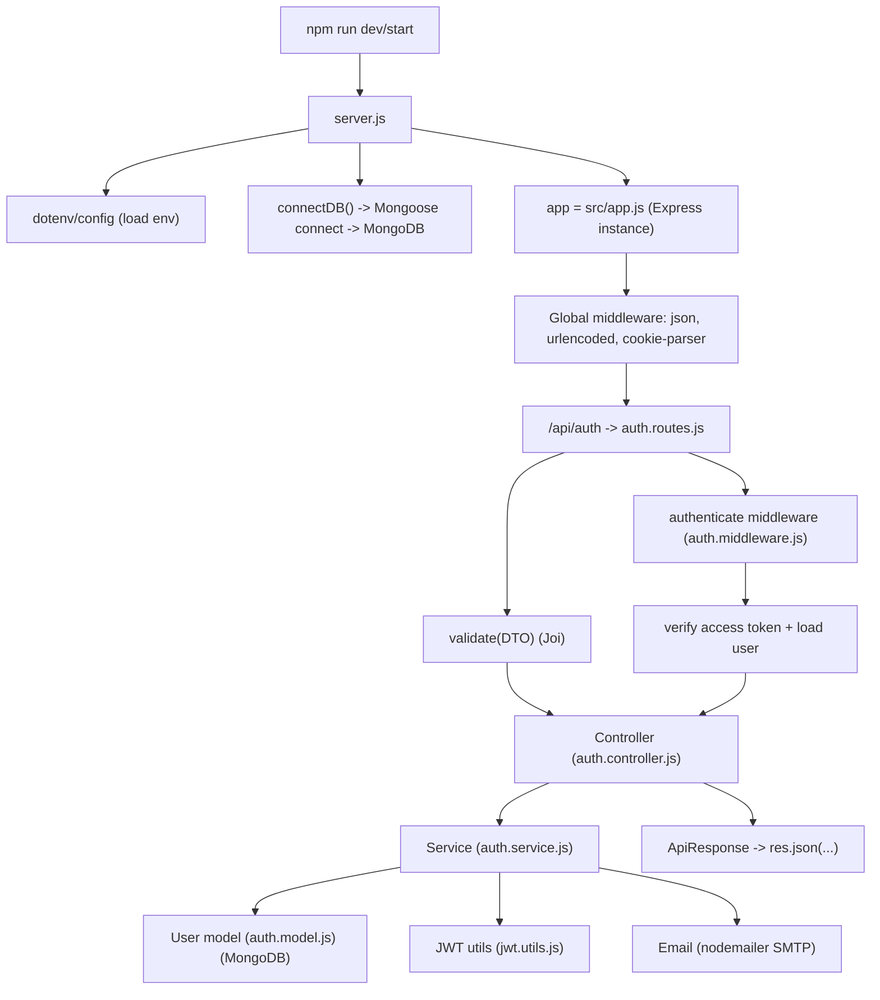

# Code Flow — `01-Build REST-API Final` (Start → Request → Response)

This document explains the **complete code flow** for `01-Build REST-API Final`:

- **Where execution starts**
- **What happens when an HTTP request hits the server**
- **Why the code is split into routes/controllers/services/models/utils**

---

## Big picture “why” (the motive behind the structure)

This project uses a layered structure so each file has a clear job:

- **Routes** decide *which* function should run for a URL + HTTP method.
- **Middleware** runs *before* your route handler (for validation, auth, parsing JSON, etc.).
- **Controllers** handle HTTP concerns (read `req`, write `res`) and keep endpoints clean.
- **Services** contain business logic (rules for login, signup, tokens, etc.).
- **Models / DB layer** talks to the database (Mongo model).
- **Utils** are reusable helpers (JWT signing, email sending, response formatting).

This separation makes code:

- easier to read (each file has one job),
- easier to test (business logic is not tangled with HTTP),
- safer (auth/validation are centralized).

---

## Where the code starts (entry point)

When you run:

```bash
npm run dev
```

it runs `server.js` (see `package.json`).

Runtime flow:

1. `server.js` loads environment variables via `dotenv/config`
2. It imports the Express app from `src/app.js`
3. It connects to MongoDB using `connectDB()` (`src/common/config/db.js`)
4. It starts listening on `PORT`

## Request lifecycle (what happens for every API call)

When a request comes in (example: `POST /api/auth/login`):

1. Express parses body
   - `express.json()` reads JSON body into `req.body`
   - `express.urlencoded()` reads form-encoded bodies
2. `cookie-parser` parses cookies into `req.cookies`
3. Routing matches `/api/auth` → `src/modules/auth/auth.routes.js`
4. Optional validation middleware validates the request body (Joi DTO)
5. Controller runs (HTTP in/out)
6. Service runs (business logic + DB + token/email utilities)
7. Controller sends response via `ApiResponse`

## Visual flow (diagram “image”)



## The most important modules (what each one is doing)

- **`src/app.js`**: creates the Express app, registers global middleware, mounts `/api/auth`.
- **`src/modules/auth/auth.routes.js`**: defines endpoints like `/register`, `/login`, `/me`.
- **`src/common/middleware/validate.middleware.js`**: validates `req.body` using a DTO (Joi).
- **`src/modules/auth/auth.controller.js`**: converts service outputs into consistent HTTP responses.
- **`src/modules/auth/auth.service.js`**: does the real “auth work”:
  - create user, hash password (handled in Mongoose pre-save)
  - generate tokens (access/refresh)
  - store hashed refresh token for logout/invalidation
  - handle verify-email and reset-password flows
- **`src/modules/auth/auth.middleware.js`**: checks Bearer access token, loads user, sets `req.user`.
- **`src/common/utils/jwt.utils.js`**: signs/verifies JWT + generates reset tokens.
- **`src/common/config/email.js`**: sends verification/reset emails through SMTP.

## Example endpoint: `POST /api/auth/login` (step-by-step)

1. **Route** receives request
2. **Controller** calls `authService.login(req.body)`
3. **Service**:
   - finds user by email (with password selected)
   - checks bcrypt password
   - checks `isVerified`
   - creates access token + refresh token
   - stores *hashed* refresh token in DB
4. **Controller**:
   - sets refresh token cookie (httpOnly)
   - returns `{ user, accessToken }` in JSON

---

## How to read / debug the flow quickly (practical checklist)

- **Server doesn’t start?**
  - check entry file: `server.js`
  - check env vars (`.env`) for DB/JWT/SMTP settings
- **Route not found?**
  - confirm base path mounting: `app.use("/api/auth", authRoute)`
- **Validation error?**
  - Joi DTO via `validate.middleware.js`
- **401/Forbidden?**
  - ensure `Authorization: Bearer <access_token>` is present for protected routes
- **Token issues?**
  - access vs refresh tokens are different secrets/expiry

---

## Notes (small inconsistencies you may notice)

This file documents the intended flow. While reading, you may notice a few naming mismatches in the JS project (example: `ApiError.notFound` vs `ApiError.notfound`). That doesn’t change the *architecture flow* above, but it can affect runtime behavior if those lines execute.

