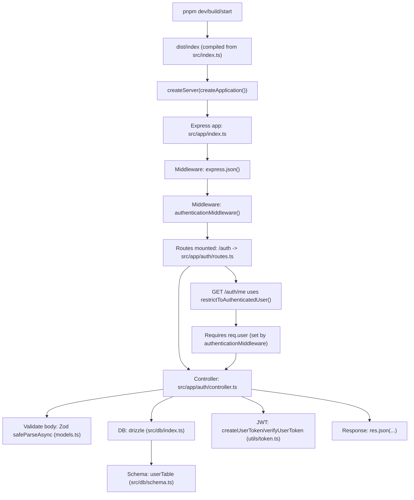

# Code Flow — `02-Auth-TS` (Start → Request → Response)

This document explains the **complete code flow** for `02-Auth-TS`:

- **Where execution starts**
- **What happens when an HTTP request hits the server**
- **Why each layer exists (motive)**

---

## Big picture “why” (the motive behind the structure)

This project separates responsibilities so the code is easier to understand and change:

- **App bootstrap**: starts the server and creates the Express app.
- **Middleware**: runs *before routes* (JSON parsing + authentication).
- **Routes**: maps URL + method to a controller method.
- **Controller**: handles HTTP input/output (reads `req`, returns `res.json(...)`).
- **DB layer**: talks to Postgres through Drizzle ORM.
- **Token utils**: creates/verifies JWT so the API can identify a user.

---

## Where the code starts (entry point)

When you run:

```bash
pnpm dev
```

the project compiles TypeScript to `dist/` and then runs `dist/index` (see `package.json` scripts).

The **source entry file** is:

- `src/index.ts`

Startup flow:

1. `src/index.ts` calls `createApplication()` from `src/app/index.ts`
2. It wraps the Express app inside a Node HTTP server: `createServer(createApplication())`
3. It starts listening on **PORT 8080**

---

## Request lifecycle (what happens for every API call)

For any incoming request (example: `POST /auth/sign-in`):

1. **Express JSON parsing**
   - `express.json()` converts JSON body → `req.body`
2. **Authentication middleware (global)**
   - `authenticationMiddleware()` looks for `Authorization: Bearer <token>`
   - If present and valid → sets `req.user`
   - If not present → request continues as “anonymous” (public routes still work)
3. **Route matching**
   - `app.use('/auth', authRouter)` mounts the auth routes
   - Examples:
     - `POST /auth/sign-up`
     - `POST /auth/sign-in`
     - `GET /auth/me` (protected)
4. **Controller handles the endpoint**
   - Validates request body using Zod `safeParseAsync`
   - Uses Drizzle to read/write the database
   - Creates JWT token on sign-in
   - Sends JSON response

---

## Visual flow (diagram “image”)



---

## Main routes and what they do

### `POST /auth/sign-up`

Flow:

1. Route → `AuthenticationController.handleSignup`
2. Validates body (Zod)
3. Checks if email already exists (DB query)
4. Creates a password hash:
   - generates `salt`
   - computes `hash = HMAC_SHA256(salt, password)`
5. Inserts user into Postgres (`userTable`)
6. Returns `201` with created user id

### `POST /auth/sign-in`

Flow:

1. Route → `AuthenticationController.handleSignin`
2. Validates body (Zod)
3. Loads user by email
4. Recomputes hash using stored `salt` and compares with stored password hash
5. Creates JWT token with payload `{ id }`
6. Returns token in JSON response

### `GET /auth/me` (protected)

Flow:

1. Global `authenticationMiddleware()` tries to set `req.user` from Bearer token
2. Route uses `restrictToAuthenticatedUser()`:
   - if no `req.user` → returns `401 Authentication Required`
3. Controller loads user by id from DB and returns basic profile fields

---

## Quick debug checklist

- **Server doesn’t start?**
  - check `src/index.ts`
  - check `.env` has `DATABASE_URL`
- **`/auth/me` returns 401?**
  - send header `Authorization: Bearer <token from /sign-in>`
- **DB errors?**
  - confirm Postgres is running and `DATABASE_URL` is correct

